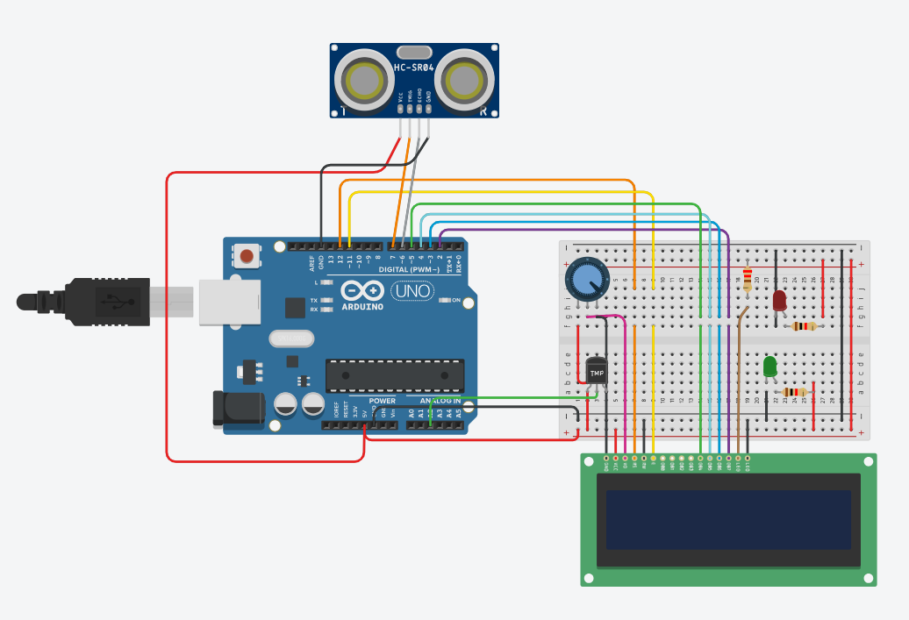

# Heat-Pass

O projeto consiste em criar um sistema que abre portas a partir da proximidade das pessoas e garante que a temperatura do ambiente esteja ideal. A interação com o sistema é intuitiva e simplificada para os usuários. Ao se aproximarem da porta, eles são detectados pelo sistema, que verifica simultaneamente a temperatura ambiente. Caso as condições sejam favoráveis, a porta é automaticamente desbloqueada, permitindo o acesso. Caso contrário, o sistema permanece seguro, evitando a abertura da porta.

O nome do projeto é “Heat Pass” que significa “Passagem de Calor”, o que transmite o intuito principal do projeto: gerar um sistema que abre portas a partir da proximidade das pessoas e que não permite que o ambiente esteja quente ou frio de mais. 

Ele foi desenvolvido para a disciplina de Microcontroladores e IOT da FMU, sob orientação do professor Ivair Lima.

## Protótipo
O protótipo deste projeto foi feito na ferramenta case Tinkercad, conforme a imagem abaixo:

## Links
- [Tinkercad](https://www.tinkercad.com/things/880Dx1P7ynV-copy-of-sensor-de-aproximacao-com-lcd-e-led/editel?sharecode=45ZU2QiLxo_lKpkJhTJuz9j-0QPIzbvmjmSOyq1FMNI)
- [Documentação](https://docs.google.com/document/d/198Q0f_WQOiTv9q8vIxJLoJf29pa0qkEY/edit?usp=sharing&ouid=111490485578439967102&rtpof=true&sd=true)
- [Apresentação](https://docs.google.com/presentation/d/1Qk1zrGR-T2nKejNFoJNVrasPRKcJMB4dQI4xfYsxDbQ/edit?usp=sharing)
- [Youtube](https://youtu.be/hKYlHHShXXg?si=LN5gz5kV9BWuEl5E)

## Autores
- [@annaagabi](https://www.github.com/annaagabi)
- [@natalia](https://www.github.com/nataliascruz)